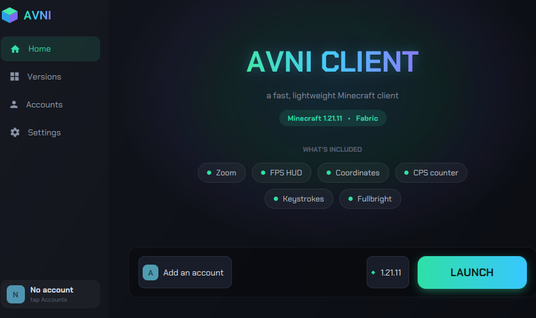
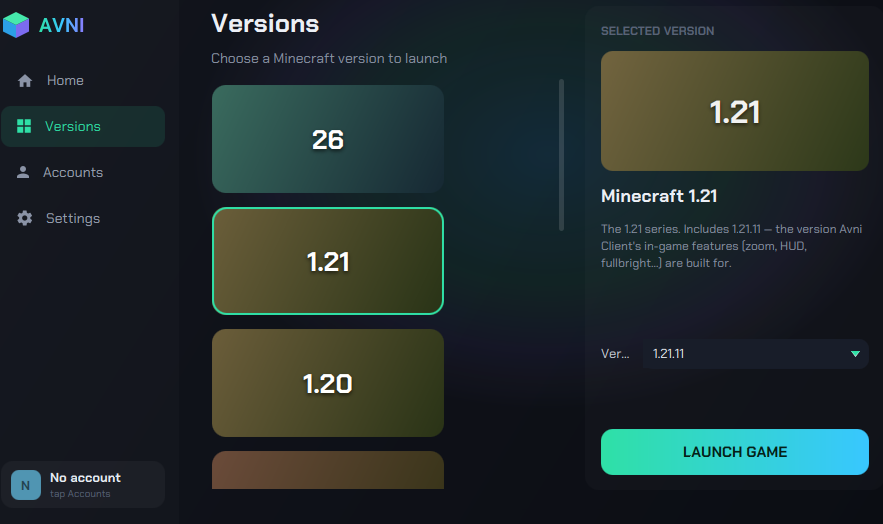
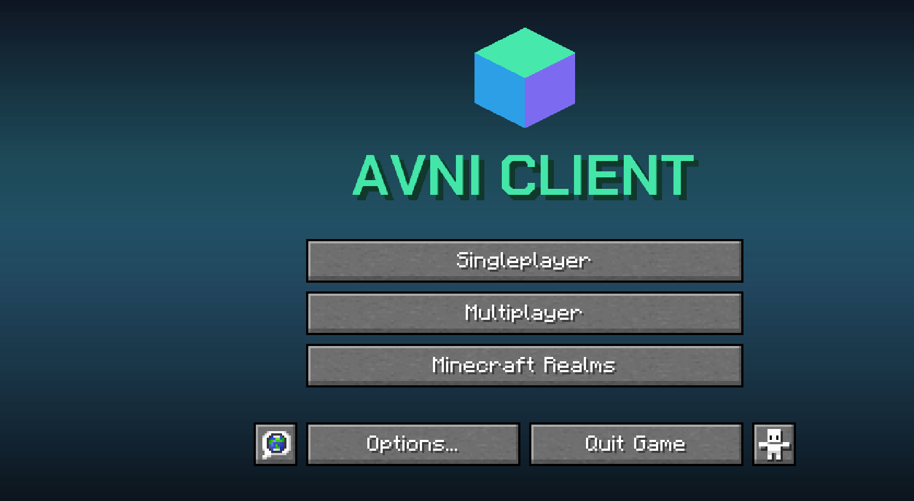

# Avni Client

A lightweight, open-source utility client for **Minecraft: Java Edition** — a Fabric mod paired
with a desktop launcher.

Avni has two parts:

- **Mod** — a [Fabric](https://fabricmc.net/) mod for Minecraft 1.21.11 that adds quality-of-life
  features to the game.
- **Launcher** — a native [JavaFX](https://openjfx.io/) desktop app that installs Minecraft and
  Fabric, manages your account and version, and launches the game with the mod included.

The launcher signs players in with their own Microsoft account using the standard Microsoft/Xbox
sign-in flow, solely to launch the game they own. It does not modify, resell, or proxy any
Microsoft or Mojang services.

## Screenshots

| Launcher | Version picker |
| :---: | :---: |
|  |  |

The custom in-game main menu:



## Features

### In-game
- Configurable HUD with a drag-and-drop editor — move, resize, and snap elements into place
  - FPS, coordinates (with chunk and biome), facing direction, CPS, memory, day counter,
    real-time clock, session timer, a compass, and a keystrokes overlay
- Waypoints — save, color, and navigate to locations
- Hold-to-zoom and a fullbright toggle
- A custom themed main menu and in-game settings panel

### Launcher
- One-click install of Minecraft, Fabric, and the matching Fabric API
- Version selection with automatic Java runtime management
- Microsoft account sign-in
- Settings for memory allocation, game directory, and in-game features
- A clean, themed interface

## Building

Requires **JDK 21**.

```bash
./gradlew build          # build the mod
./gradlew :launcher:run  # run the launcher
./gradlew runClient      # run the mod in a dev client
```

## Tech

Minecraft 1.21.11 · Fabric · Java 21 · JavaFX · Gradle

## License

[MIT](LICENSE)
